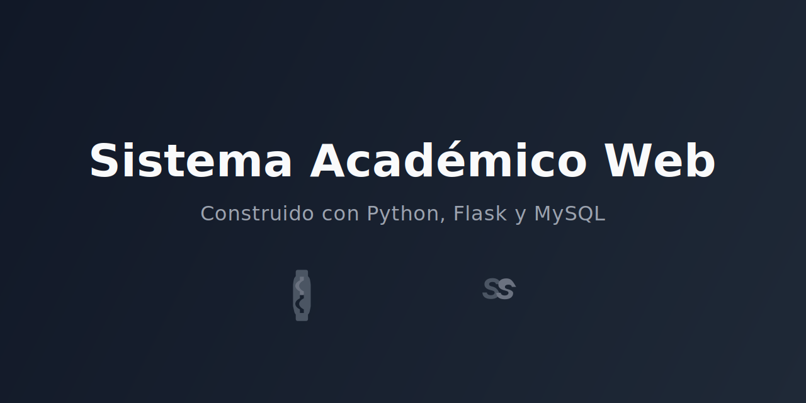

# Sistema Académico Web

Una aplicación web completa para la gestión académica, construida con una arquitectura en capas utilizando Python (Flask) y MySQL. El proyecto cuenta con una interfaz de usuario moderna, limpia y totalmente responsiva, inspirada en los mejores dashboards del mercado.


<div align="center">


</div>
---

## ✨ Demostración Visual

Aquí tienes un vistazo de la aplicación en acción.

| Dashboard Principal | Mantenimiento de Escuelas | Mantenimiento de Estudiantes |
| :---: | :---: | :---: |
|  |  |  |
| Dashboard Principal | Mantenimiento de Escuelas | Mantenimiento de Estudiantes |

| Mantenimiento de Cursos | Mantenimiento de Matriculas |
| :---: | :---: | 
|  |  |

| Vista Responsiva (Móvil) | Alerta de Confirmación |
| :---: | :---: |
|  |  |

---

## 🚀 Características Principales

-   **Dashboard Interactivo:** Visualiza estadísticas clave de un vistazo, incluyendo contadores totales y un gráfico de distribución de estudiantes por escuela.
-   **Gestión CRUD Completa:**
    -   🏫 **Escuelas:** Creación, lectura, actualización y eliminación de escuelas profesionales.
    -   🎓 **Estudiantes:** Gestión completa de alumnos, asociándolos a su escuela correspondiente.
    -   📚 **Cursos:** Mantenimiento de los cursos ofrecidos.
    -   📝 **Matrículas:** Registro y gestión de las matrículas de los estudiantes en los cursos.
-   **Búsqueda Dinámica:** Filtra registros por nombre en tiempo real para una gestión más eficiente.
-   **Diseño Responsivo:** La interfaz se adapta perfectamente a cualquier dispositivo, desde ordenadores de escritorio hasta teléfonos móviles.
-   **Alertas Interactivas:** Notificaciones de éxito/error y confirmaciones de eliminación elegantes gracias a SweetAlert2 para una mejor experiencia de usuario.
-   **Arquitectura Robusta:** Desarrollado siguiendo un patrón en capas (Controlador, Servicio, DAO) para un código limpio, mantenible y escalable.

---

## 🛠️ Tecnologías Utilizadas

| Categoría     | Tecnología                                                                                             |
| :------------ | :----------------------------------------------------------------------------------------------------- |
| **Backend**   | Python 3, Flask                                                                                        |
| **Base de Datos**| MySQL                                                                                                  |
| **Frontend**  | HTML5, CSS3, JavaScript                                                                                |
| **Librerías Clave** | Bootstrap 5, Chart.js, SweetAlert2, Font Awesome                                                     |
| **Conector DB**| `mysql-connector-python`                                                                               |

---

## 📋 Instalación y Puesta en Marcha

Sigue estos pasos para ejecutar el proyecto en tu entorno local.

### 1. Prerrequisitos

-   Python 3.8 o superior
-   Un servidor de MySQL (como MySQL Community Server, XAMPP, etc.)
-   Git

### 2. Clonar el Repositorio

```bash
git clone https://github.com/Abrilskop/SistemaAcademico.git
cd SistemaAcademico
```

### 3. Configurar el Entorno Virtual

Es altamente recomendable usar un entorno virtual.

```bash
# Crear el entorno
python -m venv .venv
```
```bash
# Activar el entorno
# En Windows:
.\.venv\Scripts\activate
```
```bash
# En macOS/Linux:
source .venv/bin/activate
```

### 4. Instalar Dependencias

Instala todos los paquetes necesarios usando el archivo `requirements.txt`.

```bash
pip install -r requirements.txt
```

### 5. Configurar la Base de Datos
1. Asegúrate de que tu servidor MySQL esté en funcionamiento.
2. Crea una base de datos llamada sistema_academico.
3. Importa el script SQL que contiene la estructura de las tablas y los procedimientos almacenados en tu base de datos.

### 6. Configurar la Conexión
Abre el archivo conexion.py y verifica que las credenciales de la base de datos (host, usuario, contraseña) sean las correctas para tu entorno local.

```bash
# conexion.py
self.conn = mysql.connector.connect(
    host="localhost",
    user="root",
    password="tu_password", # <-- Asegúrate de que esta sea tu contraseña de mysql c:
    database="sistema_academico"
)
```
7. Ejecutar la Aplicación
```bash
python main.py
¡Listo! Abre tu navegador y visita http://12.0.0.1:5000/dashboard para ver la aplicación en funcionamiento.
```
### 🏛️ Estructura del Proyecto
El proyecto sigue una arquitectura en capas para una clara separación de responsabilidades.
```bash
/SistemaAcademico
├── controladores/      # Lógica de control (maneja peticiones web)
├── dao/                # Data Access Objects (comunicación directa con la DB)
├── modelos/            # Clases que representan las entidades (Escuela, Estudiante...)
├── servicios/          # Lógica de negocio
├── static/             # Archivos estáticos (CSS, JavaScript, imágenes)
├── templates/          # Plantillas HTML (vistas)
├── .venv/              # Entorno virtual
├── conexion.py         # Módulo para la conexión a la base de datos
├── main.py             # Punto de entrada de la aplicación (rutas)
├── requirements.txt    # Lista de dependencias de Python
└── README.md           # Docs
```
                                                      ZZZZZ'
                                                     ZZZZZZZ'
                                                    ZZZZZZZZZ'
                                          ZZZZZ      ZZZZZZZ      ZZZZZ'
                                         Z     Z    ZZZZZZZZZ    Z     Z'
                                        Z  O O  Z  ZZZZZZZZZZZ  Z  O O  Z'
                                       Z         ZZZZZZZZZZZZZ         Z'
                                      Z         ZZZZZZZZZZZZZZZ         Z'
                                     ZZZZZZZZZZZZZZZZZZZZZZZZZZZZZZZZZZZZZ'
                                    Z               ZZZZZZZZZ               Z'
                                    Z                ZZZZZZZ                Z'
                                     Z      ZZZZ      ZZZZZ      ZZZZ      Z'
                                      ZZZ    ZZZZZ   ZZZZZZZ   ZZZZZ    ZZZ'
                                         ZZZ  ZZZZZZZZZZZZZZZZZZZ  ZZZ'
                                            ZZZZ   ZZZZZZZZZ   ZZZZ'
                                                   ZZZZZZZZZ'
                                                   ZZZ   ZZZ'
                                                   BYE   BYE
```
